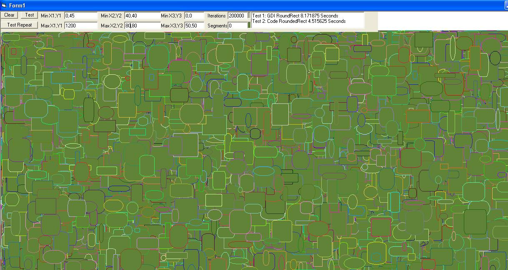



## New RoundedRect

### Description

No COMMERICAL USE

RoundRectangle (Symmetric) William W.

this roundrect function should work in windows 95 paths (WIN95=true)

all the way to the present pretty darn fast comparable to the gdi Roundrect Function and its always symmetrical

since it uses one arc of the ellipse for all the corners

also the number of segments

used to draw the corner can be specified

otherwise they are calculated to be fast yet still good quality

ONE Important Difference:

While the GDI RoundRect is considered a filled shape

This Roundrect fuction does NOT fill the shape drawn

it only frames/outlines the shape if win95= true

You use Polygon instead of polyline

if you desire filled shapes to be drawn but you lose windows 95 path compatibility (WIN95=false)

SEGMENTS

you can overide this by specifying segments when calling this function

otherwise its calculated

Note if you have too few segments it may make shapes non-symmetric

Remember when specifying segments its only for one corner so segments*4

Segments also can define quality from 0-3 above 3 segments and it defines the number of segments used to draw the figure

0=Low, 1=Med Low, 2=Med, 3= High, 4= 4 segments, 5= 5 segments, 6=......

I was looking for info on drawing Round Rectangles really could not find too much that would also work in Windows 95 I tried bezier curves but they were very hard to get perfectly symmetrical results due to the right/Bottom clipping in compatibility mode and frequently the edges were unsightly

so heres my RoundRect that works in Windows 95 paths has customiziable segments and seems to output what the GDI RoundRect outputs but in a higher quality and most times faster try it out let me know if you like it

sorrry to updaye so soon i found a math error that was giving weird results fixed

also added a few things and optmized to the max

compile it and you will really see the difference

screen shot taken in IDE
 
### More Info
 

             |
---                |---
**Submitted On**   |2010-04-10 18:28:50
**By**             |[William W](https://github.com/Planet-Source-Code/PSCIndex/blob/master/ByAuthor/william-w.md)
**Level**          |Beginner
**User Rating**    |4.5 (18 globes from 4 users)
**Compatibility**  |VB 4\.0 \(32\-bit\), VB 5\.0, VB 6\.0
**Category**       |[Graphics](https://github.com/Planet-Source-Code/PSCIndex/blob/master/ByCategory/graphics__1-46.md)
**World**          |[Visual Basic](https://github.com/Planet-Source-Code/PSCIndex/blob/master/ByWorld/visual-basic.md)
**Archive File**   |[New\_Rounde2178744102010\.zip](https://github.com/Planet-Source-Code/william-w-new-roundedrect__1-73056/archive/master.zip)

